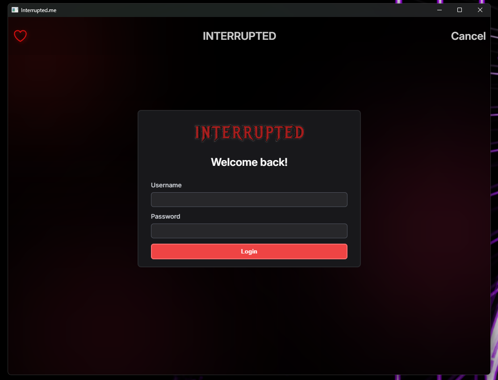
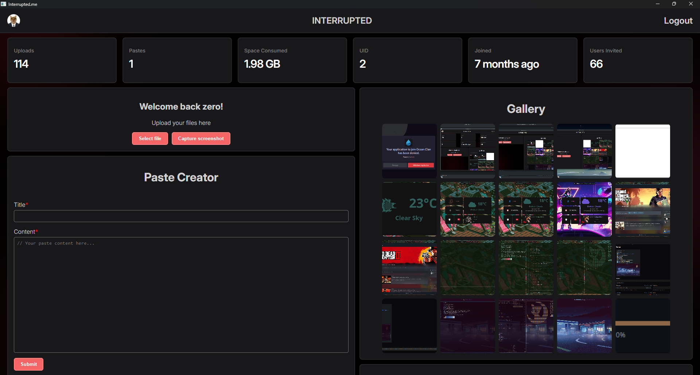

<div align="center">
    
    
</div>

# Interrupted Desktop Application

## Prerequisites

- Go version 1.22.5 or newer must be installed on your machine.

## Installation
### Windows
1. Download the Latest Version:
    - Download the latest release of the application.
2. Run the Application:
    - Simply double-click `interrupted.exe` in Windows Explorer, or run it from the command line:
        ```
        interrupted.exe
        ```
### Linux
1. Install Dependencies:
```
sudo apt-get update
sudo apt-get install -y libgtk-3-dev
```
2. Download the Latest Version:
    - Download the latest release of the application.
3. Make the Application Executable:
```
chmod +x interrupted-ubuntu-latest # You only need to do this once.
```
4. Run the Application:
```
./interrupted-ubuntu-latest
```
### macOS
1. Install Dependencies:
```
brew install gtk+3
```
2. Download the Latest Version:
    - Download the latest release of the application.
3. Make the Application Executable:
```
chmod +x interrupted-macos-latest # You only need to do this once.
```
4. Run the Application:
```
./interrupted-macos-latest
```

# License
Distributed under the MIT License. See `LICENSE` for more information.
